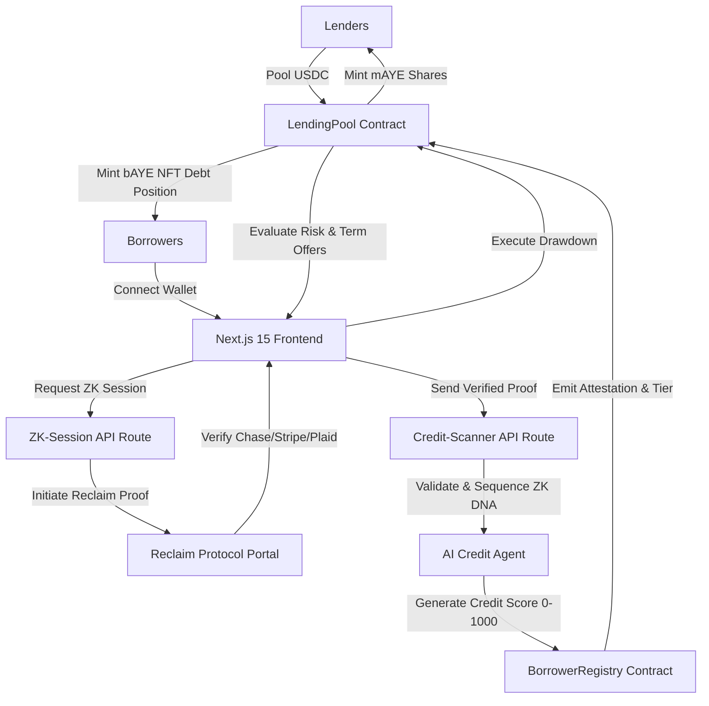

# Maye — AI-Powered Unsecured Consumer Lending Protocol

Maye is a next-generation consumer lending protocol deployed on the **Base Sepolia Testnet** that enables unsecured (under-collateralized) loans by replacing traditional credit scores with off-chain AI assessment and privacy-preserving **Zero-Knowledge Proofs (ZKPs)**.

---

## 📐 Architecture & Mechanics

Maye bridges off-chain financial data and on-chain capital allocation via a privacy-preserving trust layer. Below is the system flow:



---

## 🌟 Core Features

### 🤖 AI-Agent Underwriting
* **Alternative Data Signals**: Analyzes real-time metrics (balances, transaction counts, wallet history) to assign a dynamic credit score from `0` to `1000`.
* **Risk Tiers**: Maps credit scores into four credit-worthiness tiers (Tier 0 to Tier 3) that determine maximum loan caps and dynamic borrowing interest rates.

### 🔒 Privacy-First Zero-Knowledge Verification
* **Reclaim Protocol Integration**: Ingests cryptographic proofs from banking portals (e.g., Chase), payment processors (e.g., Stripe), or API hubs (e.g., Plaid).
* **Identity Guarding**: Assures that the financial parameters (e.g., "monthly sales > $5,000") are valid without exposing raw usernames, API keys, bank balances, or personal identification.

### 🎨 Tokenized Debt (`bAYE` NFTs)
* **ERC-721 Representation**: Active borrowing positions are represented as `bAYE` dynamic NFTs minted to the borrower.
* **On-chain Art Engine**: Renders dynamic SVGs directly in the contract metadata, reflecting the real-time status of the loan (e.g., `Current`, `Delinquent`, `Defaulted`).

### 🏦 Yield-Bearing Pools (`mAYE` Vault)
* **Capital Efficiency**: Lenders deposit USDC to provide borrowing liquidity and receive yield-bearing `mAYE` ERC-20 vault shares.
* **Dynamic Interest Rates**: Loan interest rates scale algorithmically based on pool utilization and the borrower's credit tier.

---

## 🛠️ Technology Stack

* **Frontend**: Next.js 15 (App Router), TypeScript, Tailwind CSS v4, Wagmi v2, RainbowKit v2, Viem.
* **Smart Contracts**: Solidity `^0.8.28`, Foundry (Forge + Cast).
* **Privacy Layer**: Reclaim Protocol ZK-SDK.
* **Network**: Base Sepolia.

---

## 📂 Project Structure

```
maye/
├── src/                          # Next.js 15 Web Application
│   ├── app/                      # App Router pages & APIs
│   │   ├── api/                  # API routes (ZK sessions & Credit sequencing)
│   │   ├── apply/                # Unified borrowing apply flow
│   │   ├── dashboard/            # Borrower command center
│   │   ├── lend/                 # Lender deposit/withdraw panel
│   │   └── page.tsx              # Brand homepage
│   ├── components/               # React UI components (shadcn/ui layout)
│   ├── hooks/                    # Custom Web3 hooks
│   └── lib/                      # Providers (Theme, Wallet, Toast)
├── contracts/                    # Solidity Smart Contracts
│   ├── Tokens/                   # ERC-20 (mAYE) and ERC-721 (bAYE) tokens
│   ├── LendingPool.sol           # Core lending/borrowing pool logic
│   ├── BorrowerRegistry.sol      # Borrower registrations & oracle scoring
│   └── interfaces/               # Protocol interface definitions
├── test/                         # Smart Contract Tests (Forge Suite)
│   ├── LendingPool.t.sol         # Deposit, borrow, and repayment tests
│   ├── BorrowerRegistry.t.sol   # Registration, score updates, bans, and access tests
│   ├── MAYE.t.sol                # Vault share tests
│   └── Integration.t.sol         # End-to-end borrowing & repayment scenarios
├── scripts/foundry/              # Deployment and setup scripts
└── foundry.toml                  # Foundry framework configurations
```

---

## ⚡ Getting Started

### Prerequisites
* **Node.js**: `v20` or higher
* **Foundry**: Install via `curl -L https://foundry.paradigm.xyz | bash` followed by `foundryup`

### 1. Installation
Clone the repository and install the frontend dependencies:
```bash
git clone https://github.com/yourusername/maye.git
cd maye
npm install
```

### 2. Configuration
Copy the environment variables template and configure your local settings:
```bash
cp .env.example .env
```
Update `.env` with your variables:
* `DEPLOYER_PRIVATE_KEY`: Private key of the deployer wallet (for smart contract scripts).
* `ALCHEMY_API_KEY`: Your Alchemy API key for Base Sepolia.
* `NEXT_PUBLIC_RECLAIM_APP_ID` & `RECLAIM_APP_SECRET`: Reclaim application credentials.

---

## 🧪 Testing & Development

### Local Dev Server
Start the Next.js development server:
```bash
npm run dev
```
Open [http://localhost:3000](http://localhost:3000) to view the web application.

### Smart Contract Compilation
Compile the Solidity contracts using Forge:
```bash
npm run compile
# or directly: forge build
```

### Run Foundry Tests
Run the contract test suite (145 tests, 100% pass rate):
```bash
npm run test:foundry
# or directly: forge test -vv
```

### Testing Breakdown

| Suite | Contract Tested | Tests | Status |
| :--- | :--- | :--- | :--- |
| **`Counter.t.sol`** | `Counter.sol` | 2 | ✅ PASS |
| **`MAYE.t.sol`** | `mAYE.sol` (Vault) | 30 | ✅ PASS |
| **`LendingPool.t.sol`** | `LendingPool.sol` (Lending flows) | 57 | ✅ PASS |
| **`BorrowerRegistry.t.sol`** | `BorrowerRegistry.sol` (Registry) | 41 | ✅ PASS |
| **`Integration.t.sol`** | End-to-end flows | 15 | ✅ PASS |
| **Total** | | **145** | **100% PASS** |

---

## 🎨 Design System & Colors

Maye features a bespoke, editorial minimalist design system defined by the following core CSS custom properties:

| Color Token | Variable | Hex Code | Purpose |
| :--- | :--- | :--- | :--- |
| **Sage** | `--color-sage` | `#a9ddd3` | Active brand accent, successful actions, key CTAs |
| **Bone** | `--color-bone` | `#e8e3d5` | Surfaces, card backgrounds, borders |
| **Ink** | `--color-ink` | `#010101` | High contrast primary text, dark UI elements |
| **White** | `--color-white` | `#fdfcfa` | Main page canvas background |

---

## 📄 License
This project is licensed under the MIT License. See [LICENSE](LICENSE) for details.
